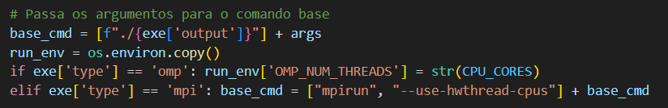
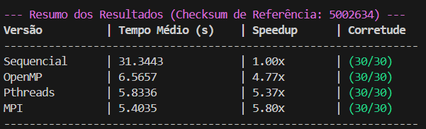

# Relatório

### Primeiros passos
- Edição do código sequêncial para visualização do problema;
- Identificação de funções paralelizáveis;
- Verificação de condições de corrida;

**Observação importante**

Cálculo do tempo das duas funções não paralelizadas
('assign_points_to_clusters' e 'update_centroids'):  

    assign_points_to_clusters - 99%
    update_centroids - menor que 1%
Conclusão: Não vale a pena paralelizar a função update_centroids.

## OpenMP

### 1 - Teste de paralelização na função 'assign_points_to_clusters'

- Teste realizado com paralelização básica no for triplo oculto na função.  

Comparação de resultados 3000 pontos, 5 dimensões, valores entre 0 e 1000, 10 clusters e 20 iterações.  
(Checksum de referência: 24787)

    | Versão             | Corretude | Tempo (s) | SpeedUp |
    --------------------------------------------------------
    | Sequencial         |    ✔️    | 0.001077  | 1.00x   |
    | OpenMP (4 threads) |    ✔️    | 0.000567  | 1.90x   |
    | OpenMP (8 threads) |    ✔️    | 0.000626  | 1.70x   |


Comparação de resultados 1000000 pontos, 10 dimensões, valores entre 0 e 10000, 100 clusters e 50 iterações:

    | Versão             | Corretude | Tempo (s) | SpeedUp |
    --------------------------------------------------------
    | Sequencial         |    ✔️    | 29.664304  | 1.00x   |
    | OpenMP (4 threads) |    ✔️    | 8.179989   | 3.60x   |
    | OpenMP (8 threads) |    ✔️    | 5.191413   | 5.70x   |
    
> Conclusão: Ponto importante a ser paralelizado, não foi afetado por condições de corrida como previmos.

### 2 - Teste de paralelização na função 'update_centroids'

- Teste realizado com paralelização básica no primeiro for duplo da função.

Comparação de resultados 1000000 pontos, 10 dimensões, valores entre 0 e 10000, 100 clusters e 50 iterações.  (Checksum de referência : 5002634).

    | Versão             | Corretude | Tempo (s) | SpeedUp |
    --------------------------------------------------------
    | Sequencial         |    ✔️    | 29.664304 | 1.00x   |
    | OpenMP (4 threads) |    ❌    | 27.304870 | 1.08x   |
    | OpenMP (8 threads) |    ❌    | 27.778409 | 1.07x   |

> Nota: Aparentemente a função é pouco reelevante na questão de trabalho e paralelização, resultado errado.  
Possíveis condições de corrida: cluster_sums, cluster_counts.

Comparação de resultados depois da correção:   

    | Versão             | Corretude | Tempo (s) | SpeedUp |
    --------------------------------------------------------
    | Sequencial         |    ✔️    | 29.664304 | 1.00x   |
    | OpenMP (4 threads) |    ✔️    | 28.636637 | 1.03x   |
    | OpenMP (8 threads) |    ✔️    | 27.298111 | 1.08x   |

> Conclusão: A paralelização não se mostrou tão efetiva nessa parte função, apesar se ter um speedup, não foi significante, uma das causas pode ser a existência de duas condições de corrida

- Teste realizado com paralelização básica no segundo for duplo da função.

Comparação de resultados 1000000 pontos, 10 dimensões, valores entre 0 e 10000, 100 clusters e 50 iterações.  
(Checksum de referência: 5002634).

    | Versão             | Corretude | Tempo (s) | SpeedUp |
    --------------------------------------------------------
    | Sequencial         |    ✔️    | 27.645900 | 1.00x   |
    | OpenMP (4 threads) |    ✔️    | 27.350647 | 1.01x   |
    | OpenMP (8 threads) |    ✔️    | 27.350647 | 1.02x   |
    
> Conclusão: Como esperado a função não é significante para paralelização

- Teste realizado com a paralelização combinada nos dois fors duplos.

Comparação de resultados 1000000 pontos, 10 dimensões, valores entre 0 e 10000, 100 clusters e 50 iterações.
(Checksum de referência: 5002634).

    | Versão             | Corretude | Tempo (s) | SpeedUp |
    --------------------------------------------------------
    | Sequencial         |    ✔️    | 27.458599 | 1.00x   |
    | OpenMP (8 threads) |    ✔️    | 27.517199 | 0.99x   |

> Conclusão: Sem resultado significativo

### 3 - Teste de paralelização nas funções 'assign_points_to_clusters' 'update_centroids' simultâneamente

- Teste realizado com paralelização básica nas duas funções.

Comparação de resultados 1000000 pontos, 10 dimensões, valores entre 0 e 10000, 100 clusters e 50 iterações.
(Checksum de referência: 5002634).

    | Versão             | Corretude | Tempo (s) | SpeedUp |
    --------------------------------------------------------
    | Sequencial         |    ✔️    | 27.469135 | 1.00x   |
    | OpenMP (4 threads) |    ✔️    | 9.097608  | 3.02x   |
    | OpenMP (8 threads) |    ✔️    | 5.823352  | 4.72x   |

> Conclusão: Os resultados são positivos porém não superaram a paralelização apenas da função 'assign_points_to_clusters'

### 4 - Conclusão final

Para esse primeiro estudo utilizando OpenMp como método de paralelização, chegamos a uma conclusão importante que citamos anteriormente: devemos nos importar com a paralização da função 'assign_points_to_clusters', responsável por aproximadamente 99% do tempo consumido pelo programa.


## MPI

###  Tentativas de paralelização

- Estão descritas as etapas do pensamento para a resolução do problema de paralelização com memória distribuída

**1 - Paralelização e transmissão do conjunto de pontos (Point points)**

Resultados: Foi possível rodar o código que por sua vez, gerou resultados errados
> Conclusões: A função MPI_Scatter não lida bem com arrays de tipos artificiais, com isso tivemos que pensar em outra forma de transmitir os dados
    
**2 - Análise mais detalhada do problema**  

Uma vez que não seria possível compartilhar o array de pontos, buscamos entender os outros dados do problema:
```bash
Point* centroids:
Um array com os centroides criados que é atualizado conforme os pontos vão sendo distribuidos.
Todo o conjunto de centroids é utilizado no cálculo, portanto após cada computação individual os centroides deveriam ser transmitidos para todos os processos.
```

    int* all_coords:
    O elemento chave para a resolução do problema, se antes não poderiamos transmitir arrays do tipo Point, com o all_coords podemos, esse vetor armazena as informações de pontos e centroides, atraves de ponteiros, com isso podemos pensar na solução final.


**3 - Paralelizando**

- Para facilitar a resolução o vetor all_coords foi dividido em 2, points_coords e cluster_coords
        
**3.1 Dividindo os dados**

Para cada processo, precisamos definir um conjunto de pontos e sua respectiva points_coords, inicialmente a tentativa foi de criar 2 scatters, um para pontos e outro para coords de pontos, essa solução não funcionou pois, como já vimos, scatter não lida bem com o tipo Point, para isso distribui-se apenas o vetor coords e depois recalcula-se os pontos locais.

Depois foi necessário lidar com a lógica de centroides, são os mesmos para todos os processos, porém foi necessário realizar um broadcast do vetor cluster_coords para todos os processos, uma vez que, apenas o rank 0 realiza a leitura dos dados.

**3.2 Resolvendo a lógica do loop principal**

Aqui está o maior problema para a paralelização em MPI, o loop principal é dividido em duas etapas, alocar pontos, e atualizar centroides, porém como vimos, o vetor de centroides e igual para os processos, para isso a seguinte lógica foi necessária

    | assign_points_to_clusters 
    | criar buffers globais para o cálculo 
    | modificação da função update_centroids para reduzir e calcular os valores locais
    | repassar os centroides atualizados 
    | atualizar os ponteiros  
    | ... (repetir)
    v

**3.3 Recuperando os dados**

Por fim resta buscar os dados nos points_coords locais e junta-los para calcular o resultado final

### Resultados
Comparação de resultados 1000000 pontos, 10 dimensões, valores entre 0 e 10000, 100 clusters e 50 iterações.  
(Checksum de referência: 5002634).

    | Versão                     | Corretude | Tempo (s) | SpeedUp |
    ----------------------------------------------------------------
    | Sequencial                 |    ✔️    | 25.673548 | 1.00x   |
    | MPI (4 processos)          |    ✔️    | 7.722227  | 3.32x   |
    | MPI (8 processos)          |    ✔️    | 5.143490  | 4.99x   |
    | MPI (--use-hwthread-cpus)  |    ✔️    | 3.582064  | 7.16x   |

> Nota (--use-hwthread-cpus): Não foi possível testar o programa para mais de 8 processos por conta da limitação de cores da máquina, entretanto ao adicionar essa flag ao mpirun, definimos o número de processos como o número máximo de threads lógicas do processador

> Conclusão: Resultado satisfatório na paralelização

## Pthreads

**1 - Paralelização na função assign_points_to_clusters**

Para resolução do problema com Pthreads, foi necessária a criação de um struct para viabilizar a passagem de parâmetros, já que pthreads aceita apenas um formato de função para ser paralelizada (void* func(void* arg)).
```bash
struct ThreadArgs {
    Point* points;
    Point* centroids;
    int num_pontos;
    int num_clusters;
    int num_dimensoes;
    int thread_id;
    int thread_count;
};
```
Além disso foi necessária uma função de passagem entre o fork e a função desejada (assign_points_to_clusters), a função void* thread_assign_points(void* args), que divide o trabalho e chama a função principal.

- Teste

    Comparação de resultados 1000000 pontos, 10 dimensões, valores entre 0 e 10000, 100 clusters e 50 iterações.  
    (Checksum de referência: 5002634).

        | Versão               | Corretude | Tempo (s) | SpeedUp |
        ----------------------------------------------------------
        | Sequencial           |    ✔️    | 24.981434 | 1.00x   |
        | Pthreads (4 threads) |    ✔️    | 9.144942  | 2,73x   |
        

**2 - Paralelização na função euclidean_dist_sq**

Criação de um novo struct para viabilizar a passagem de parâmetros.
```bash
struct DistArgs {
    Point* p;
    Point* c;
    int start_dim;
    int end_dim;
    long long partial_sum;
};
``` 
Além disso foi necessária uma função de passagem entre o fork e a função desejada (euclidean_dist_sq), sendo a função void* partial_distance(void* a), que divide o trabalho e chama a função principal.


- Teste

    > Ao tentar realizar o teste com o dataset.txt a execução demorou muito (e foi concelada antes de ser realizada completamente), pode-se concluir, então, que a paralelização dessa forma da função euclidean_dist_sq não é otimizada, tornando a execução mais lenta que a original (sequencial).

    > Conclusão: euclidean_dist_sq é sim parte do problema, porém é uma parte pequena dele e já foi englobada na paralelização da função assign_points_to_clusters.


**3 - Paralelização na função assign_points_to_clusters e update_centroids simultâneamente**

Criação de um novo struct para viabilizar a passagem de parâmetros para a paralelização da função update_centroids, seguindo o padrão de pthreads (void* func(void* arg)). 
```bash
struct ThreadArgsUpdate {
    Point* points;
    int num_pontos;
    int num_clusters;
    int num_dimensoes;
    int thread_id;
    int thread_count;
    long long* local_sums;
    int* local_counts;
};
```
Além disso foi implementada a função void* thread_accumulate(void* args) que divide o trabalho entre as threads, onde cada thread processa um subconjunto dos pontos e acumula resultados em arrays locais privados (local_sums e local_counts), evitando as condições de corrida. A paralelização foi aplicada apenas no primeiro loop, enquanto o segundo loop de cálculo das médias permanece sequencial por ter a complexidade bem menor.

- Teste
 
    Comparação de resultados 1000000 pontos, 10 dimensões, valores entre 0 e 10000, 100 clusters e 50 iterações.  
    (Checksum de referência: 5002634).

        | Versão               | Corretude | Tempo (s) | SpeedUp |
        ----------------------------------------------------------
        | Sequencial           |    ✔️    | 31.940996 | 1.00x   |
        | Pthreads (4 threads) |    ✔️    | 6.993517  | 4,56x   |


Criação o struct ThreadArgs para permitir a passagem de parâmetros às threads.
```bash
struct ThreadArgs {
    Point* points; 
    Point* centroids; 
    int num_pontos; 
    int num_clusters; 
    int num_dimensoes; 
    int thread_id; 
    int thread_count; 
    int start; 
    int end;
};
```

Além disso foi implementada a função void* thread_assign_points(void* args), responsável por processar um subconjunto dos pontos. Cada thread calcula o centróide mais próximo apenas para os pontos dentro do seu intervalo (start a end), evitando sobreposição de dados e condições de corrida. No main, a criação e junção das threads (pthread_create e pthread_join) foram adicionadas em torno da fase de atribuição, substituindo o loop sequencial original. 

- Testes: 
    Comparação de resultados 1000000 pontos, 10 dimensões, valores entre 0 e 10000, 100 clusters e 50 iterações.  
    (Checksum de referência: 5002634).

        | Versão               | Corretude | Tempo (s) | SpeedUp |
        ----------------------------------------------------------
        | Sequencial           |    ✔️    | 31.318116 | 1.00x   |
        | Pthreads (4 threads) |    ✔️    | 6.899724  | 4,53x   |
        
    > Conclusão: Os resultados obtidos não foram significantivos em relação aos anteriores


## Avaliação Final

Durante a execução do programa de avaliação avaliador.py, tivemos alguns contratempos para o programa em MPI, a execução com mpirun foi limitada pelo número de cores da máquina, embora o programa tenha identificado o número de cores como 16, o flag -np limita a execução à 8 processos, para resolver esse problema momentâneamente fizemos uma alteração nas flags do mpirun, e passamos a utilizar --use-hwthread-cpus, assim atingimos o limite da threads lógicas do processador, obtendo melhores resultados.



### Resultados

Seguem os resultados obtidos para as 3 versões finais para os 3 métodos de paralelização. (16 núcleos).

